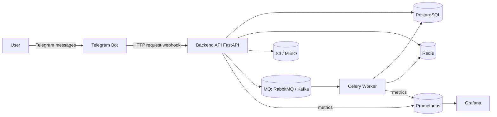

# Архитектура

Система построена вокруг Backend API, который обслуживает Telegram-бота, сохраняет данные в PostgreSQL, кэширует выдачу в Redis и отправляет события взаимодействий в очередь для асинхронной обработки.

## Общая схема компонентов

