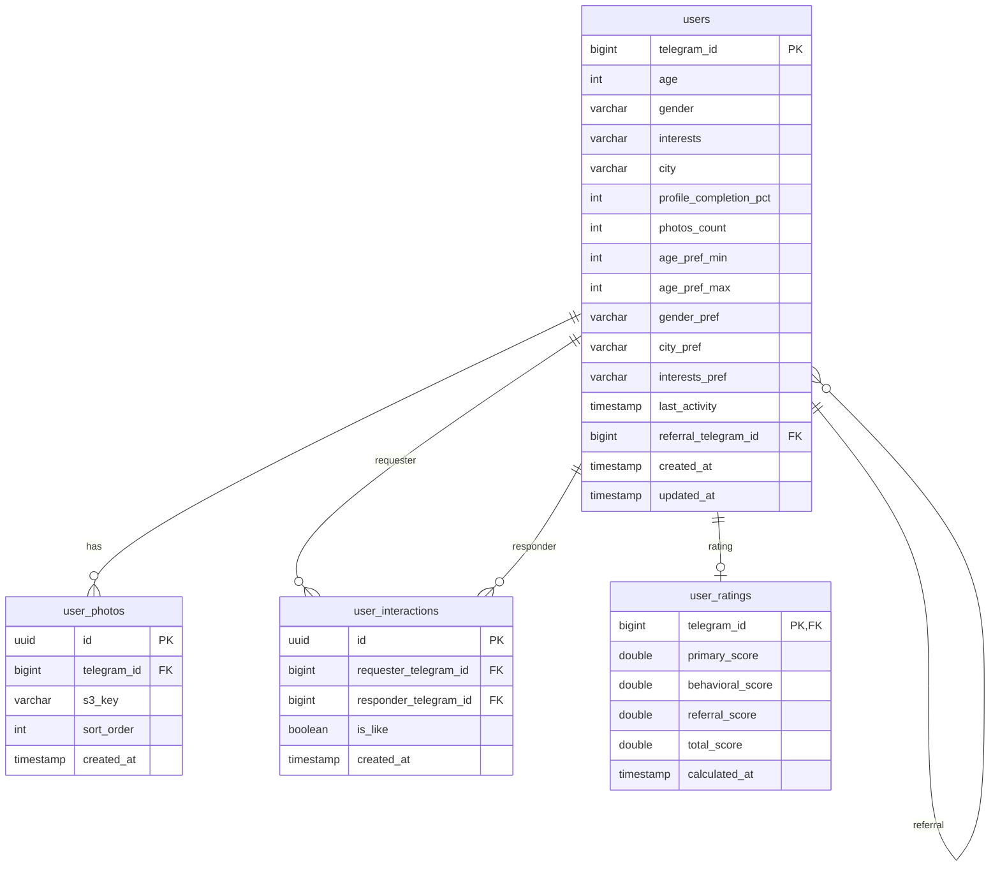

# Схема данных (PostgreSQL)

Схема намеренно компактная: хранит анкету, фото, взаимодействия и итоговый рейтинг в отдельной таблице (под регулярные пересчёты воркером).

## ER-диаграмма

## Ограничения и индексы (идея)
- **`users.telegram_id`** — основной идентификатор пользователя (удобно, т.к. приходит из Telegram).
- **Рефералка**: `users.referral_telegram_id -> users.telegram_id` (nullable).
- **Уникальность взаимодействия**: один пользователь не должен оценивать одну и ту же анкету больше одного раза:
  - Unique(`requester_telegram_id`, `responder_telegram_id`) в `user_interactions`.
- **Индексы**:
  - `user_interactions (requester_telegram_id, created_at)`
  - `user_interactions (responder_telegram_id, created_at)`
  - `users (city, gender, age)`
  - `user_ratings (total_score)`

## События, которые пишет Backend
Backend фиксирует взаимодействие в `user_interactions`, а затем публикует событие в MQ. Пример payload (логическая модель):
- `InteractionCreated`: requester, responder, is_like, created_at
- `FeedRequested`: requester, timestamp, context (например, город/предпочтения)

## Рейтинг: уровни и хранение

### Уровень 1 — первичный (`primary_score`)
Считается из анкеты:
- Возраст/пол/интересы/город
- **Полнота профиля** (`profile_completion_pct`)
- **Количество фото** (`photos_count`)
- Первичные предпочтения: возрастной диапазон, пол, город, интересы

### Уровень 2 — поведенческий (`behavioral_score`)
Считается из фактов взаимодействий:
- Количество лайков
- Соотношение лайков/пропусков
- Частота взаимных лайков (мэтчей) как доля взаимных лайков
- Частота инициирования диалогов после мэтча (как событие, если добавится)
- Временные параметры активности (например, активность по часам суток через `last_activity` + события)

### Уровень 3 — комбинированный (`total_score`)
Интегрирует уровни по весовой модели и учитывает реферальный фактор:
\[
total\_score = w_1 \cdot primary\_score + w_2 \cdot behavioral\_score + w_3 \cdot referral\_score
\]
где \(w_1 + w_2 + w_3 = 1\).

`referral_score` — надбавка за приглашённых пользователей (например, логика «за каждого активного приглашённого»).

## Кэш выдачи (Redis): формат ключей
- `candidates:{telegram_id}` → список следующих анкет (например, 10 `telegram_id`), TTL 5–15 минут.
- Когда список заканчивается, Backend снова формирует пачку на основе `user_ratings.total_score` + фильтров предпочтений.

