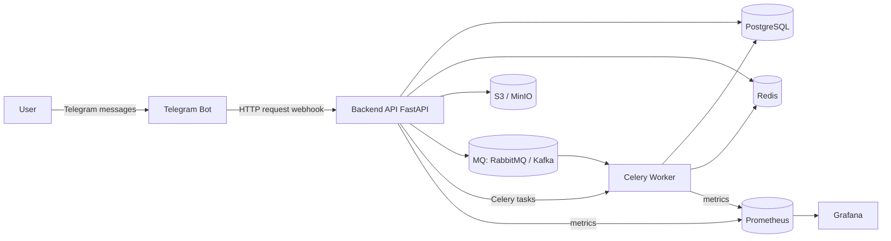

# Архитектура

Система построена вокруг Backend API, который обслуживает Telegram-бота, сохраняет данные в PostgreSQL, хранит фото в MinIO/S3, кэширует выдачу в Redis, отправляет события в RabbitMQ и ставит фоновые задачи пересчета рейтинга в Celery.

## Общая схема компонентов

## Текущая реализация

- Backend API реализован на FastAPI и экспортирует `/metrics`.
- RabbitMQ используется и как очередь доменных событий, и как Celery broker.
- Redis используется для candidate cache и как Celery result backend.
- MinIO совместим с S3 API; backend хранит в PostgreSQL только ключи и метаданные фото.
- Celery Worker пересчитывает рейтинг точечно после изменений и регулярно через Celery Beat.
- При недоступном Celery backend выполняет пересчет синхронно, чтобы локальный UX не зависел от worker.
